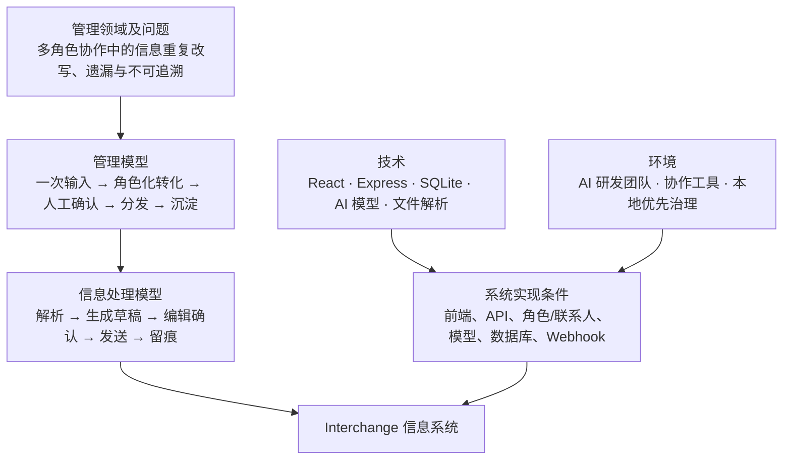

# Interchange

Interchange 是一个本地优先的角色化信息转化与协同工具，面向普通个人、协作团队和负责人。用户输入一次可核实的事实，即可按不同角色的关注点、偏好方案和沟通习惯，生成可审阅、可编辑的针对性信息。

AI 编程团队和多 Agent 协作是它的重点专业场景，而非唯一场景。无论是日常协同、项目沟通、管理汇报，还是开发任务分工，Interchange 都帮助人和 AI 获得适合自身的上下文；管理判断与对外发送始终由人审阅并确认。

完整定位见 [产品定位](docs/00-product-positioning.md)。

## 系统全景



## 当前能力

- **角色化分析与改写**：将同一份客观信息改写为适合不同收件人或角色的内容。
- **可配置的自定义角色**：可创建任意角色，设置默认关注点、可复用偏好方案和联系人专属偏好；AI 可协助生成可编辑的关注点建议。
- **多格式文件转 Markdown**：集成微软开源项目 MarkItDown，可将 Word、PDF、Excel、PowerPoint、HTML、CSV 等常见工作文件转换为 Markdown 内容，并提供下载。
- **可审阅的草稿与人工确认**：生成内容不会自动发出，用户可审阅、编辑，再决定用于沟通、辅助判断或发送。
- **Webhook 与钉钉转发**：已确认的消息可通过钉钉群机器人或通用 Webhook 发送给多人。
- **AI 编程与多 Agent 协作**：两个 AI 编程软件角色可生成面向下游 AI Agent 的开发提示词，包含任务边界、文档、验收、协作和测试要求。
- **长期规范沉淀**：Agent Skill 支持类 OpenSpec 的开发工作流与项目知识归档。
- **本地优先的数据边界**：上传文件默认在本地解析，原始文件不会默认发送给外部文件或视觉模型。

## 适用场景

### 普通用户协同

- 为家人、同事、客户或合作伙伴，将同一份事实转成不同关注点的说明。
- 为自定义角色配置“关心什么、如何表达、需要什么行动”，减少反复改写和信息遗漏。
- 将会议记录、计划、通知或文件内容转为可审阅的沟通草稿。

### 管理决策辅助

- 为负责人或管理者整理与其关注点相符的进展、风险、待确认事项和下一步行动。
- 先由人审阅 AI 生成的草稿，再自行作出判断、修改内容或决定是否发送。
- 系统不编造结论、承诺、责任人或时间，不代替用户作出或执行管理决策。

### AI 编程与多 Agent 协作

- AI 编程团队将同一份需求、缺陷说明或发布信息同步给多个岗位。
- 多个 AI 编程 Agent 围绕同一任务分工协作，并在执行前明确上下文、边界和验收标准。
- 将确认后的开发变更沉淀为可读、可追踪、可复用的类 OpenSpec 规范文档。

## 工作流程

1. 输入客观事实，或上传 Word、PDF、Excel、PPT、HTML、截图等文件。
2. 在本地解析文件并转换为可编辑文本，支持下载转换后的 Markdown。
3. 为收件人选择内置角色，或创建自定义角色、关注点与偏好方案。
4. 调用模型生成面向不同角色的草稿。
5. 人工审阅、修改草稿，并将其用于沟通或辅助决策。
6. 用户确认后，才通过钉钉机器人或 Webhook 转发给指定收件人。
7. 在 AI 编程场景中，可使用项目 Skill 将已确认的变更沉淀为长期规范文档。

## 内置角色与自定义能力

内置角色包括产品、测试、研发组长、部门领导、客户、我的 AI 编程软件和同项目同事的 AI 编程软件。

其中两个 AI 编程软件角色是开发场景专用的提示词角色：下游 AI 会先读取相关项目文档、明确任务边界与待确认问题，再进入实现阶段。除此以外，用户可创建任意通用自定义角色，并设置默认关注点、偏好方案或联系人专属偏好；这些能力不限定于软件开发。

## 演进方向

后续将探索面向普通用户的通用决策支持体验，以更易审阅的方式呈现重点、风险、待确认事项和备选行动。该方向仍遵循事实保留与人工确认原则；当前版本不提供自动决策、自动执行、通用角色模板库或未经确认的自动化流程。

## 技术栈

- 前端：Vite、React、TypeScript
- 后端：Express、TypeScript
- 存储：SQLite、better-sqlite3
- AI 调用：OpenAI 兼容 Chat Completions 接口，默认使用 DeepSeek
- 文件解析：MarkItDown、Mammoth、pdf-parse、read-excel-file、Tesseract.js
- 消息发送：通用 Webhook、钉钉机器人 Markdown 消息
- 测试：Vitest、Supertest

## 快速开始

### 1. 安装依赖

```bash
npm install
```

### 2. 配置环境变量

复制环境变量示例文件：

```bash
cp .env.example .env
```

至少需要配置：

```env
DEEPSEEK_API_KEY=your_deepseek_api_key
DEEPSEEK_MODEL=deepseek-v4-flash
TEXT_MODEL_PROVIDER=deepseek
PORT=4120
SQLITE_PATH=./data/interchange.sqlite
MARKITDOWN_COMMAND=markitdown
MARKITDOWN_TIMEOUT_MS=15000
```

如果没有配置 `DEEPSEEK_API_KEY`，应用仍然可以启动，但生成角色化草稿时会返回清晰的配置错误。

### 3. 安装 MarkItDown

Interchange 默认调用系统中的 `markitdown` 命令：

```bash
pip install "markitdown[all]"
```

如果 MarkItDown 安装在其他位置，可通过 `.env` 中的 `MARKITDOWN_COMMAND` 指定命令名或可执行文件路径。

### 4. 本地启动

```bash
npm run dev
```

后端 Express 服务使用 `.env` 中的 `PORT`，前端由 Vite 开发服务启动。

### 5. 构建与测试

```bash
npm run build
npm test
```

## 主要环境变量

| 变量 | 默认值 | 说明 |
| --- | --- | --- |
| `DEEPSEEK_API_KEY` | 空 | 服务端调用文本模型所需的 API Key。 |
| `DEEPSEEK_MODEL` | `deepseek-v4-flash` | 默认 DeepSeek 模型。 |
| `TEXT_MODEL_PROVIDER` | `deepseek` | 文本模型提供方。 |
| `VISION_MODEL_PROVIDER` | `none` | 外部视觉模型默认关闭。 |
| `FILE_MODEL_PROVIDER` | `none` | 外部文件模型默认关闭。 |
| `SQLITE_PATH` | `./data/interchange.sqlite` | 本地 SQLite 数据库路径。 |
| `UPLOAD_LIMIT_MB` | `25` | 上传文件大小限制。 |
| `MARKITDOWN_COMMAND` | `markitdown` | MarkItDown CLI 命令。 |
| `MARKITDOWN_TIMEOUT_MS` | `15000` | MarkItDown 转换超时时间。 |

## 项目结构

```text
.
├── src/                  # React 前端
├── server/               # Express API、文件解析、消息发送、AI 路由、SQLite 持久化
├── docs/                 # 产品定位、需求、方案、调研与演示材料
├── tests/                # API、解析器、提示词、发送逻辑与模型路由测试
├── agent-skills/         # 早期项目本地 Skill
├── agent-skills-v2/      # 可迁移的 Agent Skills 与 OpenSpec-like 工作流
└── agent-skills-dist/    # Skill 分发产物
```

## API 概览

- `GET /api/health`：服务状态与模型配置
- `GET /api/roles`：查看内置与自定义角色、角色偏好和偏好方案
- `GET /api/role-profiles`：查看角色画像预设
- `POST /api/roles`、`PATCH /api/roles/:key`、`DELETE /api/roles/:key`：管理自定义角色
- `POST /api/roles/:key/preference-sets`、`PATCH /api/preference-sets/:id`、`DELETE /api/preference-sets/:id`：管理偏好方案
- `POST /api/role-suggestions`：生成可编辑的角色关注点或偏好方案建议
- `GET /api/contacts`、`POST /api/contacts`、`PUT /api/contacts/:id`、`DELETE /api/contacts/:id`：管理收件人
- `POST /api/inputs/parse`：解析文本或上传文件
- `POST /api/generate`：生成角色化草稿
- `POST /api/send`：发送已确认消息
- `GET /api/records`：查看最近生成与发送记录

## 安全与合规边界

- 浏览器端不会接触模型 API Key。
- 钉钉机器人 Secret 仅保存在服务端，联系人 API 不会返回其值。
- 上传文件默认在本地解析；外部视觉模型和外部文件模型默认关闭。
- 只有可编辑的文本会进入后续 DeepSeek 生成流程，原始附件不会由 `/api/generate` 上传。
- 生成内容不会自动发送，必须由用户审阅并确认。
- 系统用于辅助信息理解与协同，不代替用户作出管理决策。

## Agent Skills 与长期规范沉淀

`agent-skills-v2` 将 Interchange 的开发协作能力扩展到 Web 应用之外，提供角色化消息转换、AI 编程上下文生成、人工确认关口、确认后的 Webhook 发送和类 OpenSpec 工作流。

这部分是 AI 编程场景的专业能力：它可从客观事实生成面向一个或多个 AI Agent 的执行提示词，并在实现和验证后归档为长期项目规范；它不代表对普通用户自动执行决策或任务。

## 许可证

当前项目尚未声明许可证。正式公开发布或接受外部贡献前，建议补充明确的开源许可证。
